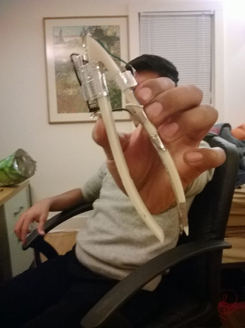
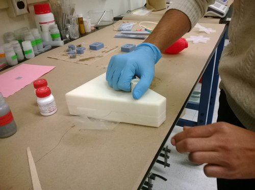
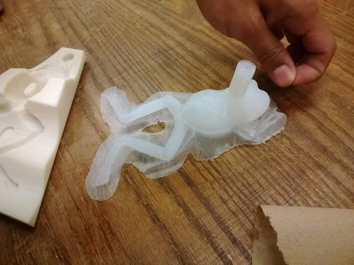
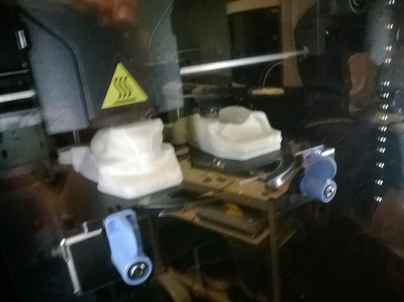
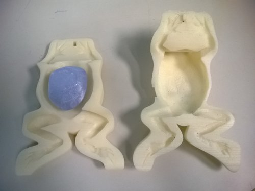
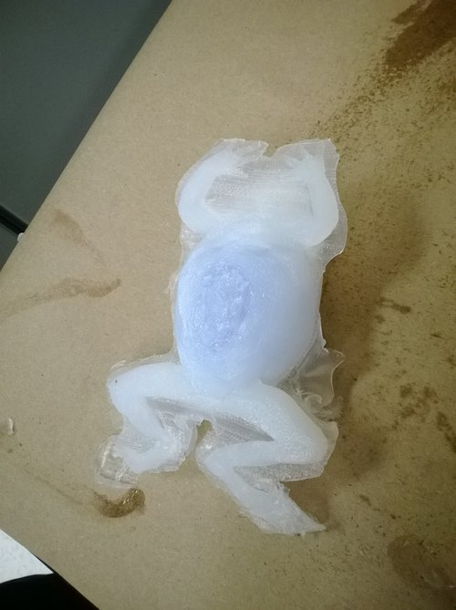
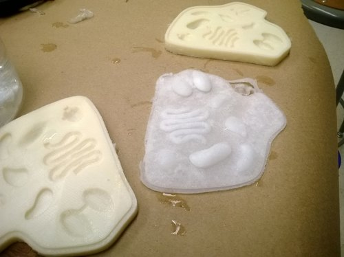
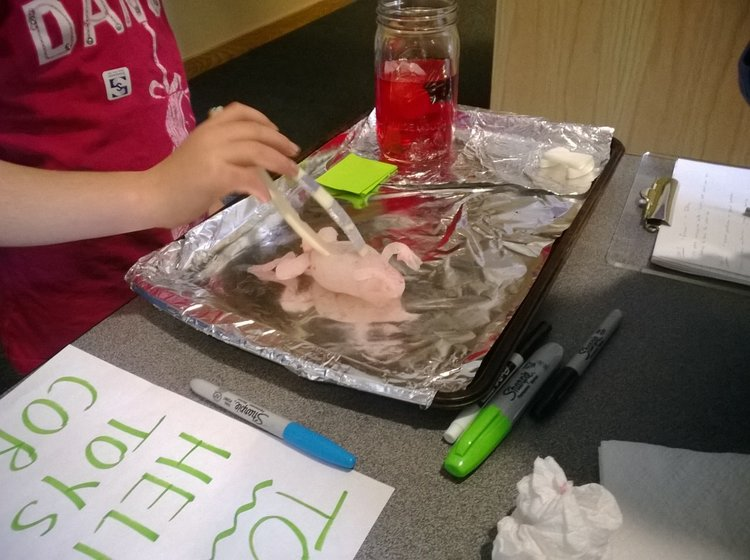
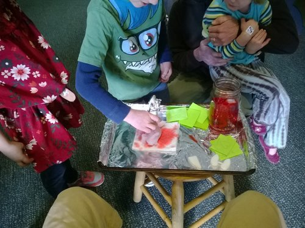

#### Teammates:
[Alex Krolick](https://alexkrolick.com/), Sam Daly

#### Professor:
Robert Shepherd

## Summary

My favorite project at Cornell, Flopper the Frog was a game we designed as a 21st century take on Hasbro's Operation. Flopper was a silicone frog body with spongy silicone organs we prototyped using novel techniques involving 3D printed (FDM) molds and [modified silicones](https://cornell.flintbox.com/#technologies/76b9d5de-6d12-4084-99ee-3abc60e46795) from Dr. Shepherd's research. The game concept was to follow instructions on our website, [flopperthefrog.com](http://flopperthefrog.com/), and remove organs, as instructed by a series of clues about the frog's body. Unlike in Operation where the board, i.e. human, was the contact point - the tweezers themselves buzzed in hand when too much force was applied in tweezing out the organs.  The fully functional game was demoed at various toy stores and the Science Center in Ithaca, NY. All the children who played the game were very receptive of it, the team felt the game was a total success, and likely market viable.

## Photos

*Fig. 1: Tweezer prototype, if an organ was squeezed too hard it would vibrate (me in the background)*

*Fig. 2: Molding Rev1 frog, significant excessive material on print*

*Fig. 3: Rev1 frog, chest cavity much too small*

*Fig. 4: Printing out the Rev2 frog mold, material reduced mold*

*Fig. 5: Rev2 mold*

*Fig. 6: Casting Rev2 mold*

*Fig. 7: Organs molded with salt to guarantee porosity*

*Fig. 8: Tweezing out organs from frog mold, demo at Ithaca Science Center*

*Fig. 9: Another angle of demo*
