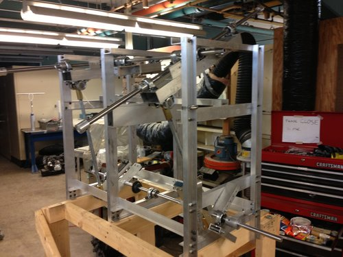
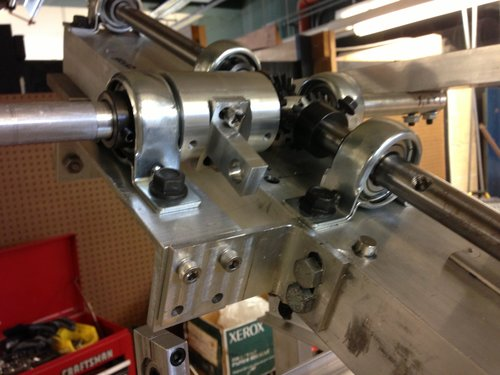
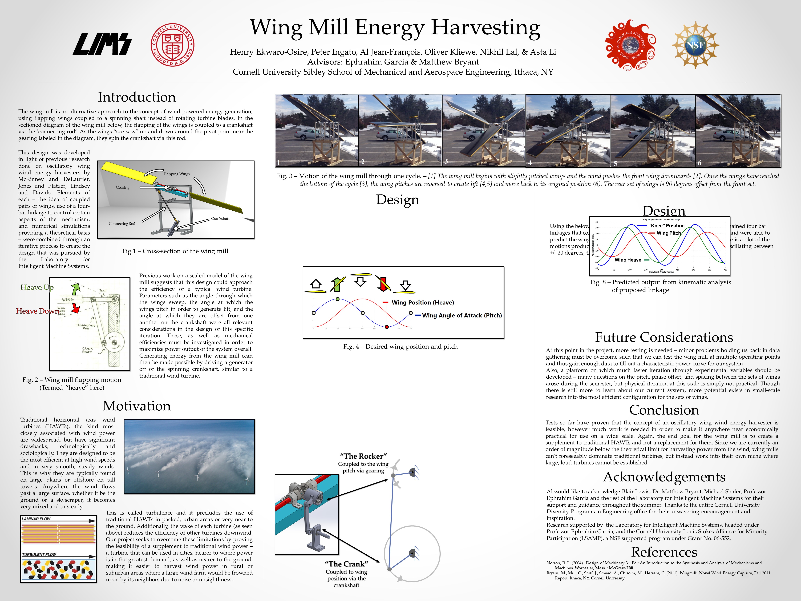

`youtube: 0uVBgRiAV7E`

*Generating a "laminar flow" condition to stimulate Wingmill consistently (rather than rely on highly variable wind patterns)*

#### Teammates:
Henry Ekwaro-Osire, Oliver Kliewe, Peter Ingato, Al Jean-Francois, Yan "Asta" Li

#### Professor:
Ephrahim Garcia (Laboratory for Intelligent Machine Systems)

## Summary

Under the guidance of the late Dr. Ephrahim Garcia, our team pursued an alternative form of wind energy harvesting that relied on oscillatory wings that repeatedly changed angle of attack to transform directional wind into rotational mechanical motion. The purpose of the Wingmill was to serve as an alternative to more traditional rotary wind power turbines where the Wingmill could more efficiently use slow, turbulent air. The device we developed had a comparatively low profile and near silent operation - solving typical problems that large rotary turbines face.

The four wings varied angle of attack repeatedly, a bio-inspired flapping design, and this flapping behavior translated into a rotary output via a four bar linkage. Substantial work was performed on the rig to reach the point shown in the videos, all wings were produced by our team with fiberglass lay-ups over foam core, hand machined aluminum and steel component integration, and system level monitoring of rotational output, torque, and active wind speed.

## Photos

*Fig. 1: WingMill articulating mechanism in Harley Davidson lab*

*Fig. 2: Bevel Gearbox and first member of 4 bar linkage*

## Literature

[Paper](AIAAPaper_Revising.pdf)

## Videos
`youtube: 6bINODuIiZI`

*Stationary test of Wingmill, in parking lot*
