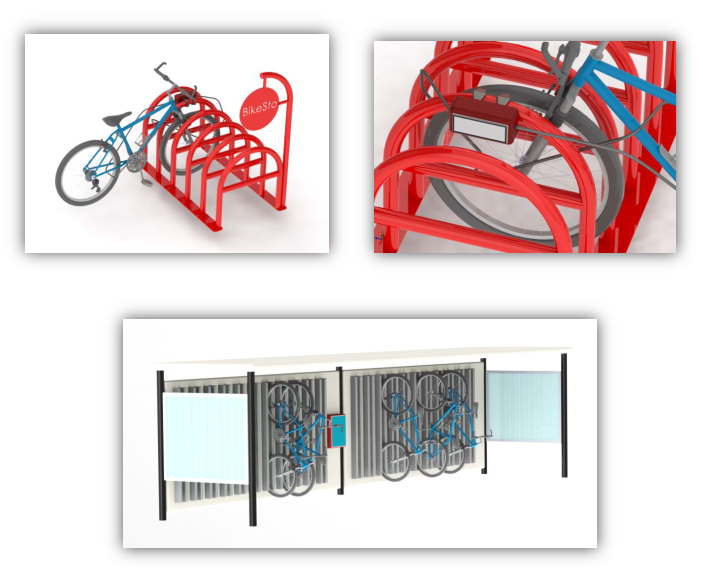

#### Teammates:
Kevin Soulard, Robert McBride, Michael Romanko
#### Professors:
George Schneider, John Nesheim

## Photos

*Small clamp on bike storage unit, and high capacity bike store*

## Summary

Our background as engineers and a shared love for bicycles led us to create BikeSto, a bike storage startup idea for an entrepreneurship course in the Johnson School. The product was a system of electronic bike locks that anyone can use anywhere. They mount to existing bike rack infrastructure, and provided distributed docks to any type of bike - not just city provided bikes. The reason this works is that, as commuters pursue safer and consequently heavier locks, the convenience of biking as a whole drops precipitously. The safer the bike lock, the more cumbersome. The inverse relationship of safety and convenience is one of the significant mitigating factors of true bike proliferation.

## Literature

[Business Plan](BusinessPlan.pdf)

[Pitch Deck](Presentation.pdf)
