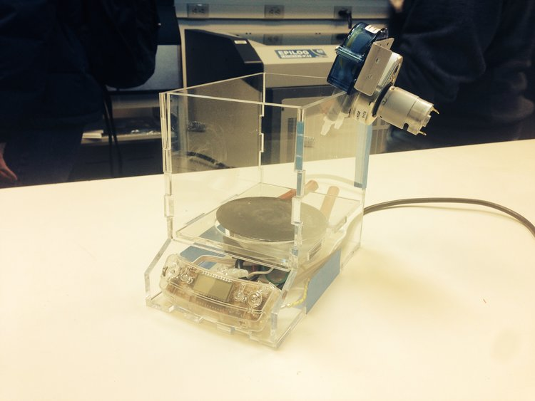

`youtube: 18qFsnMU8zE`

*Water test of pump, no finished videos pumping metal. Device was fully functional at completion.*

#### Teammates:
Paul Chang, Oliver Kliewe

#### Professor:
Robert Shepherd (Organic Robotics Lab)

## Summary
An interesting project based around the concept of, "can we move a metal and harden it on the fly". In this case, I led a team to develop a liquid pump capable of both heating and pushing the Field's metal into our desired application. Field's metal is a eutectic alloy that melts at 62C, as it is eutectic it remains fully hard up until 62C as that is a lower melting point than its composition. The pump I designed was housed in an Acrylic container, heated with a resistive heating element from a coffee pot, and a peristaltic pump to move the alloy. The project concluded with a working pump.

## Photos

*Fig. 1: Unfinished photo of metal field pump, photos lost of completed project*
