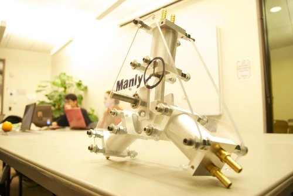
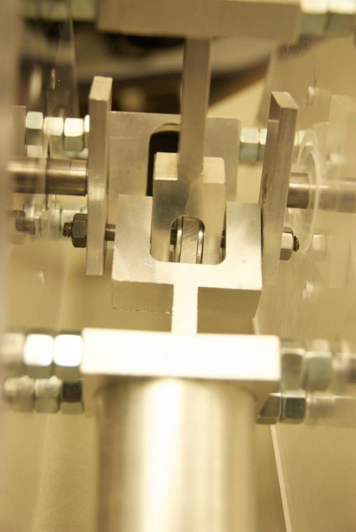
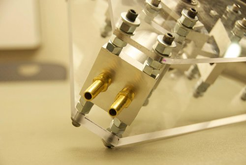

#### Teammates:
Maegan Porpora, Garrick Lau
#### Professor:
Al George

## Summary

The "windmill powered water pump" was a key design objective in the foundational class, MAE 2250, our team was the only one to pursue the triaxial, single acting piston design for our sophomore year design class. The pump performed well in competition but fell short of the performance of more traditional inline dual acting, dual piston design. Looking back I reflect fondly on the project despite numerous flaws that I would be shocked at today - using straight taps for NPT threads, missing fasteners, poorly toleranced pistons, burrs on every surface, no tolerance, etc..

## Photos

*Fig.1: Completed assembly*

*Fig. 2: Linkage converting rotary input to linear output, 2 links and 2 revolute joints. Very embarrassing.*

*Fig.3: Numerous nuts were used as spacers to save time rather than using a lathe to make them individually*
