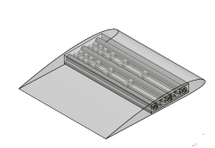

`youtube: WSTw8pgNREs`

*Wing support modeled after Fibonacci sequence demonstrating flex mechanism*

#### Professor:
Robert Shepherd

## Summary

Fundamentally, a dihedral, or upward, wing angle on a plane contributes to its stability, conversely an anhedral wing angel contributes to a plane's maneuverability. The purpose of this project was to manufacture a meso-scale model of a wing that can flexibly deform on demand using a combination of soft materials and a novel actuation mechanism. Building on research into so-called "fish line" muscles first started at University of Texas Dallas, I was able to successfully replicate their tests. Following actuator proof of concept, I design 3D printable wings both soft and hard that could be bent in Golden spirals. The wing tests showed interesting promise but the model plane that would use the wings never made it into fruition.

## Photos

*Fig. 1: Airfoil Solid model showing flexible skeleton. Shell to be made from Silicone.*
