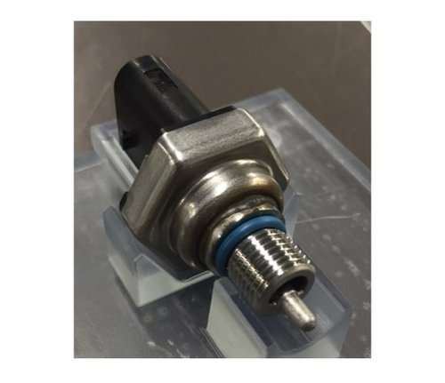
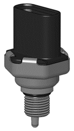
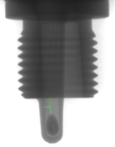

#### Title
Mechanical Design Engineer, New Product Development

## Summary

I spent 2 years developing the IPTS sensor from Concept to Launch. The sensor development itself was motivated by the need to simultaneously measure pressure and temperature on a fuel rail in a small M10 threaded package. Pressure temperature sensors are not new to the industry, but measuring the pressure of heated (140C) and pressurized (10bar) gasoline has a significant extra set of safety related requirements that existing products could not meet. The fuel system is subject to CARB requirements which mandate a hermetic sealing requirement through the entirety of its temperature range, a significant departure from typical low pressure sensing technologies available at Sensata.

## Patent
[Integrated pressure and temperature sensor](https://patents.google.com/patent/US20180073950A1/en?oq=20180073950)

## Skills

metal injection molding, plastic injection molding, elastomer testing, GD&T, AIAG standard adherence, Design to Launch NPD, process development, stamping, automated machining, DFM, customer management, design validation, hydraulic design, liquid hammer testing, thermal FEA, mechanical FEA, laser welding, resistance welding, potting, assembly debug, Six Sigma

## Photos

*Fig. 1: Sensor design in question, total ownership from Concept to Launch of the depicted parts, especially the O-Ring and threaded port*

*Fig. 2: Solid model of sensor design*

*Fig. 3: X-Ray of solid model indicating thermistor placement and novel nature of metal injection molded port design*
