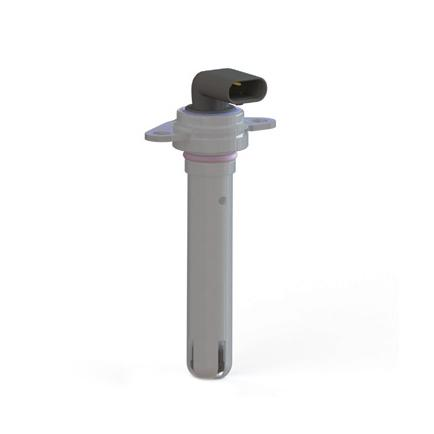
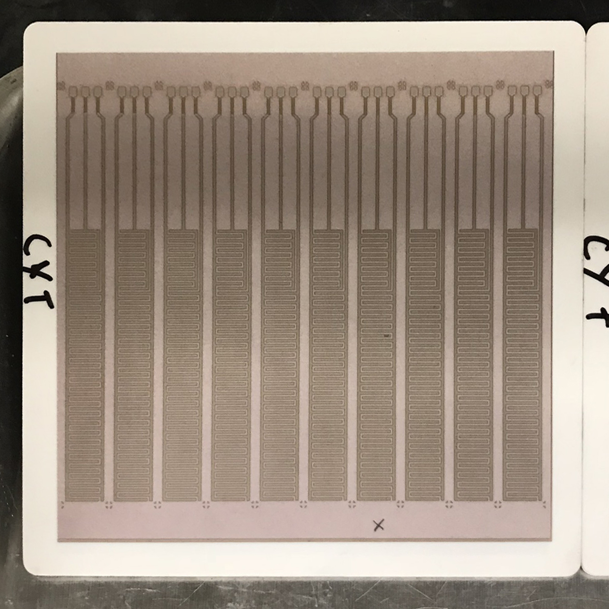
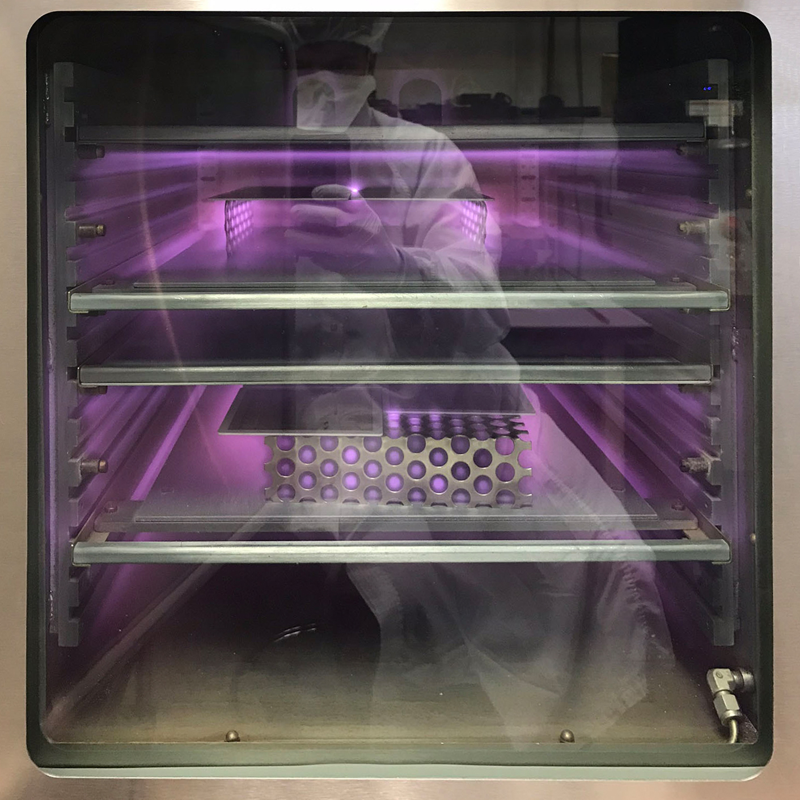
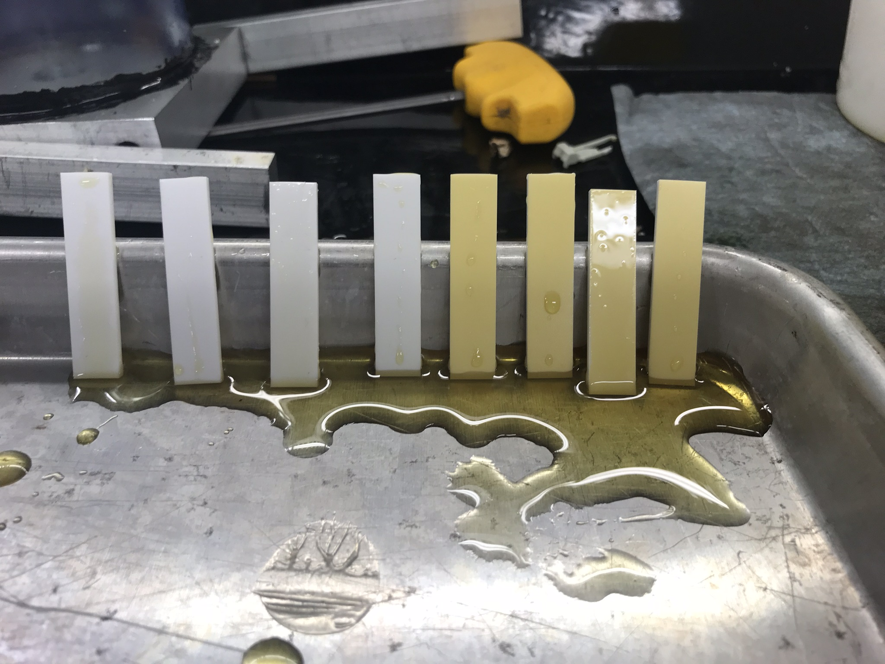
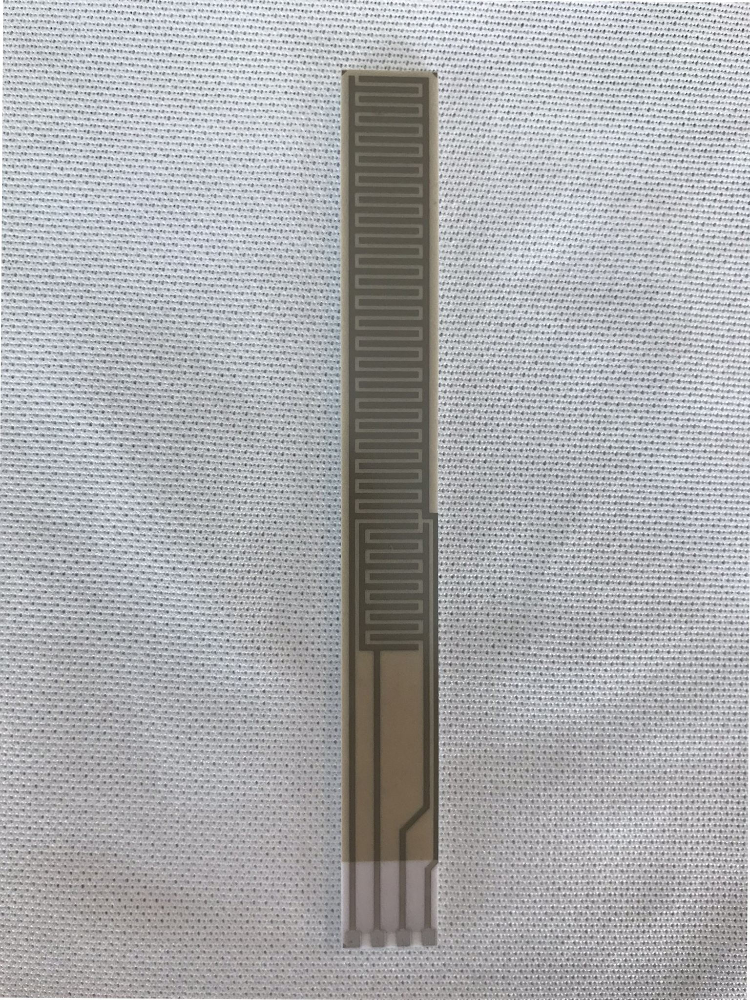

#### Title
Mechanical Design Engineer > Lead Process Design Engineer, Advanced Technologies

## Summary

During my last year at Sensata I worked on new technology development, we were assigned the mission of finding novel sensing tech, building the tech into working prototypes, and demoing the sensors for Ford, GM, and Chrysler  use cases dictated by autonomous vehicles. My responsibilities primarily surrounded package development, sensor design and manufacture for these products, and ensuring that the unique challenges posed by the technology can be solved in full scale production.

## Patent
[Fluid level sensor apparatus with inter-digitated planr capacitors for directly inserting into a fluid](https://patents.google.com/patent/US20200072651A1/en?inventor=nikhil+b+lal&oq=nikhil+b+lal)

## Datasheet
[Oil Level Sensor](https://www.sensata.com/sites/default/files/a/sensata-ols-oil%20level%20sensor-datasheet.pdf)

## Skills

Solidworks, coating development and process control, prototype sample builds on short timelines, use of SLA components in high stress environments, short turn machined samples, prototype assembly process, endcapping with silane deposition, technical screen-printing

## Photos

*Fig. 1: I developed a laser ablation method to subtractively manufacture electrode patterns on silkscreened gold, thick film substrates. We also made full circuit layouts using this method.*

*Fig. 2: Reflection of me in front of a plasma cleaner (corona treatment), many hours were spent here dialing in the process. Plasma cleaner used to prepare glass surface for silane deposition, amongst other needs that required increase surface energy.*

*Fig. 3: Evaluating various fluorinated silanes that had end-capped hydroxyl groups on glass test samples.*

*Fig. 4: Completed substrate with Inter Digitated Capacitative (IDC) electrode pattern visible through glass.*
