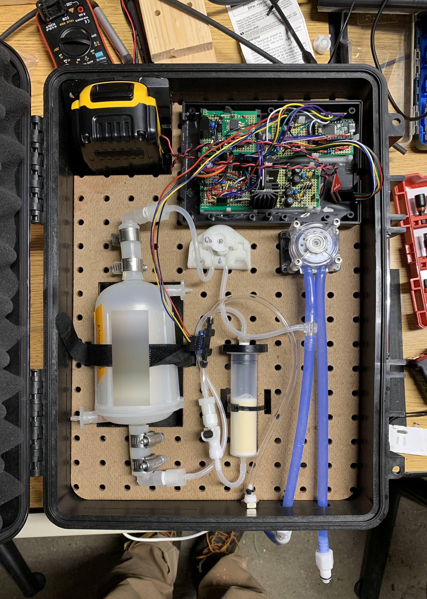
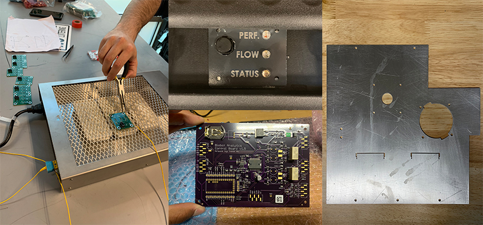

#### Title
Hardware Engineer

## Summary

Over my 10 months in Biobot the focus on my work was a pumping instrument that pumped wastewater out of a catchment and into the filtration devices. A new development, the product was an exercise in whitesheet design to be the cheapest, most robust, and most flexible design. Through the development process, 6 Design Reviews were held focusing on both technical and user interface needs. The final deliverable was 15 Gamma revision units, and a prototype developed with an IoT, cellular enabled device and successful tests of this device in the field. All technical metrics were hit or exceeded during development including: under consumption of battery life, communication from within a manhole, and precise sampling volumes.

All data published with permission from Biobot Analytics.

## Patent
[Modular system for upstream wastewater sampling](https://patents.google.com/patent/US20200072709A1/en?inventor=Nikhil+B.+Lal)

## Skills

project management, fluids, electromechanical assembly, IoT, cellular communication, battery management, prototype assembly, crimping, wiring, harness design, dc motor pumps, pressure evaluation, tubing and tubing routing, laser cutting, sheet metal design, CAD, box development, antenna evaluation

## Photos

*Fig. 1: An early prototype, pegboard scraps from lab build used as backing plate. Electronics prototyped on protoboard.*

*Fig. 2: Assorted pictures of details, innovations, and build methods. Highlights: DIY reflow solder, laser etched spray paint faceplate, custom controls PCB designed around a Teensy 3.5, waterjet pump plate prior to handbending*
