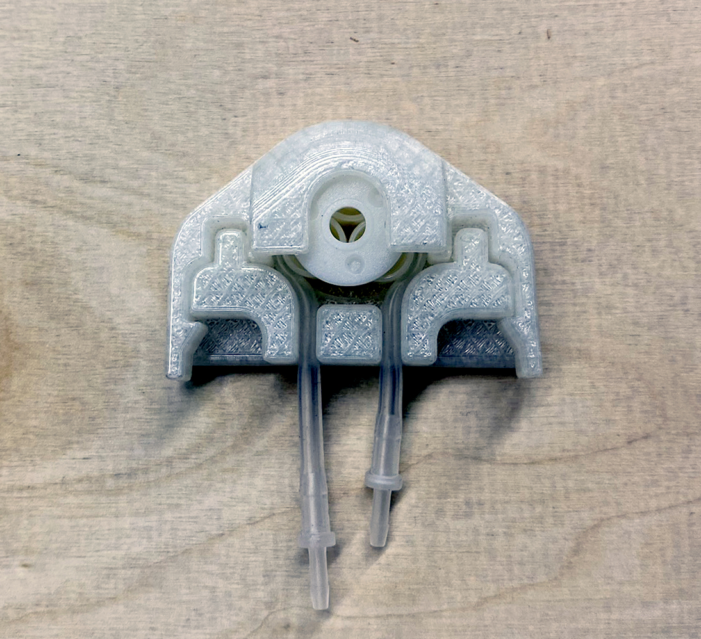

`youtube: 9FMy7yocY9k`

*3D printed Rev 7 pump housing running and pumping at 14ml/min*

## Summary

Originally designed for Biobot Analytics, the pump was never put into use as I was able to source a comparable off the shelf component. Instead, I released the files for open source use online. The pump head was designed for the cheapest peristaltic pump available on Amazon. The original pump head design was problematic and prone to failure and the tubing was extremely tedious and challenging to remove. To solve a lot of these problems, I redesigned the pump head and 3D printed out new revisions. The pump head was optimized to improve ease of use.

[Thingiverse Link](https://www.thingiverse.com/thing:4119261)

## Photos

*Fig. 1: Pump as supplied showing numerous, tiny pieces that fall apart easily and are challenging to use*

*Fig. 2: Rev 3 pump render*

*Fig. 3: Rev 7 pump render*
