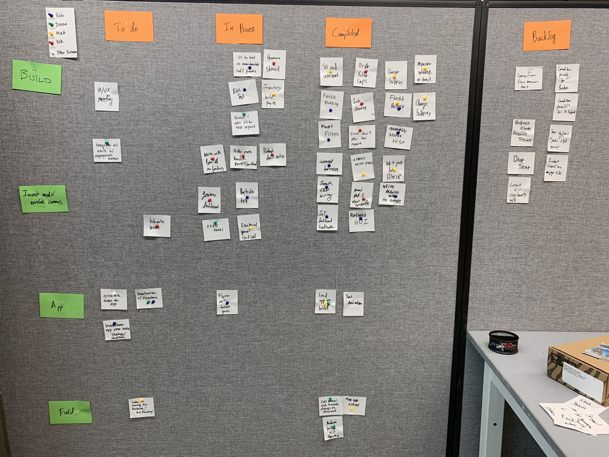

#### Role
Engineering Project Manager

## Summary

Lead daily SCRUM standups using Agile methodology to unify hardware, software, electrical, and mechanical development all under one umbrella. Colored tacks represented owner of tasks. All tasks were self regulated and assigned during the noon standups, significant revisions and guidance were provided during weekly 1on1's with engineering team.

## Photos

*Fig. 1: Example of daily standup*

*Fig. 2: Red dots indicated significant delay or help needed from another team-mate, particular attention given to red dot tasks.*
