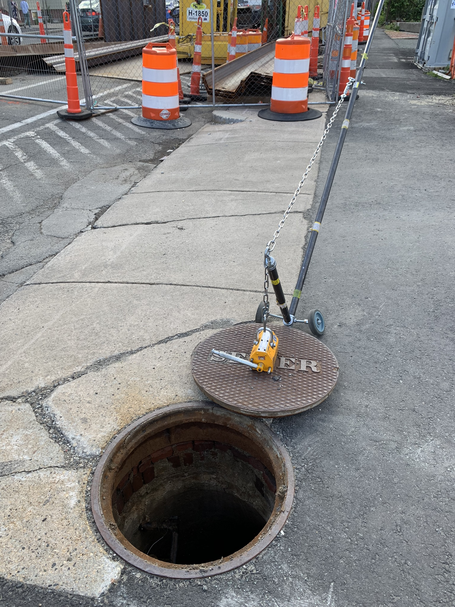

`youtube: Wc-Hrvxtb8I`

*Matt Murphy demonstrating a near finalized revision of his manhole lifter*

#### Role
Advisor

## Summary

During field work it was determined that the existing method practiced to lift manholes was flawed and very dangerous. I encouraged our intern to pursue a solution to this problem as his capstone project for his internship. Over the course of his co-op I directed him to build and develop a manhole lifter that would be easy for any member of the team to use, and it went through numerous revisions. Final revision completed all functional requirements.

## Photos

*Fig. 1: Original method used by municipal workers today of lifting a manhole, very dangerous and highly prone to failure.*

*Fig. 2: Nearly finalized revision of manhole lifter in action, final upgrades required support chain to prevent pivot point stress, and shortened chain to lifter magnet. This revision had a widened axle that helped with stability but that bent under load. Final revision had thicker, stiffer shaft custom machined for this purpose.*
