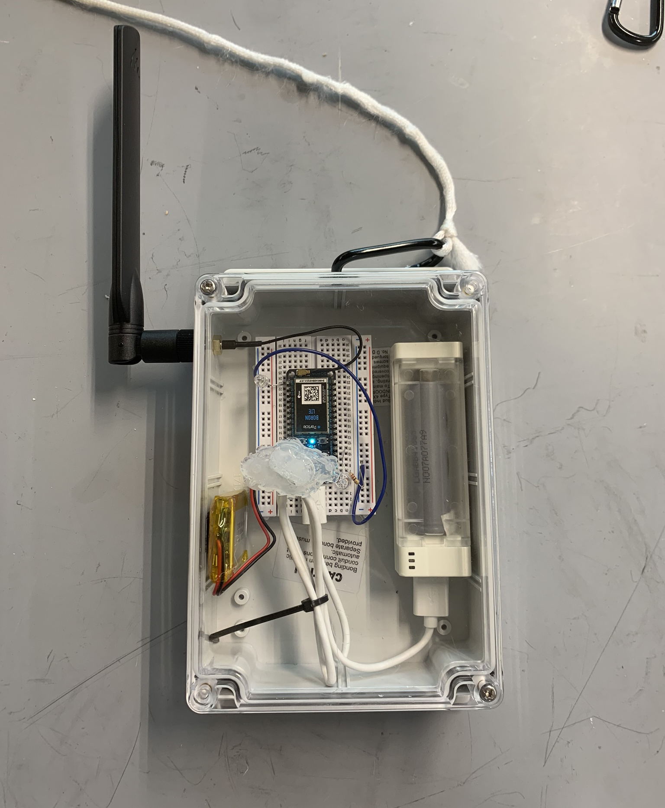
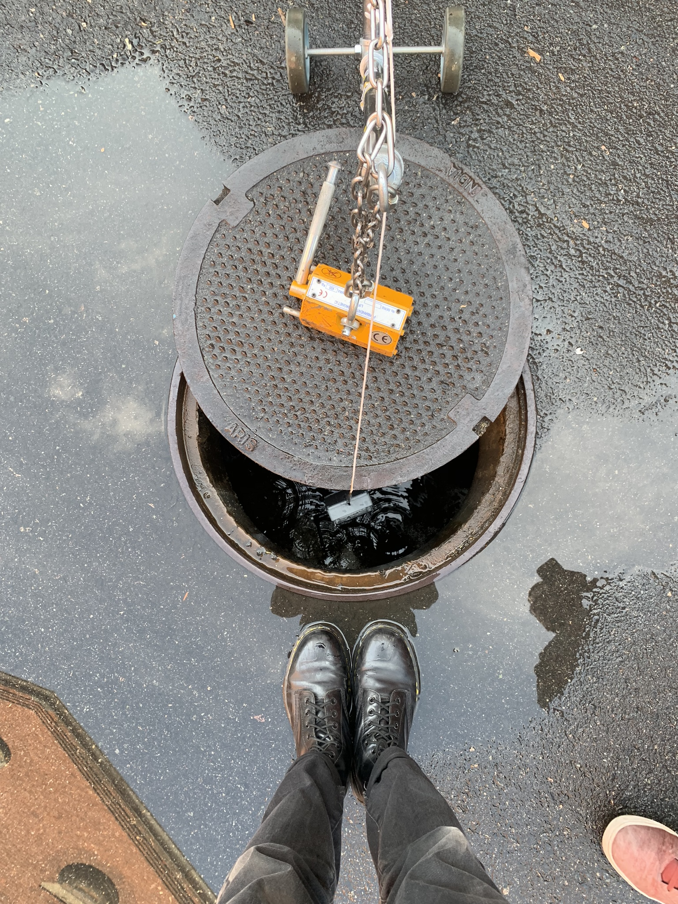

#### Role
Engineer

## Summary

Directed and led team to develop a simple waterproof test box that enabled communication from a manhole. Long thought to be impossible due to the assumption that the subterranean communication would be hindered by the manhole cover and thick cement walls, an informal Faraday cage; despite this assumption, we found an antenna and cellular enabled micro-controller configuration that allowed us to communicate from a manhole, from up to 5 ft deep. The tech developed in our mini-testbox was then grafted onto an existing gamma build unit and demonstrated that wireless communication can be enabled from an actual sampling device.

## Photos
`youtube: n7Q2LO8Xu4A`
*Fig. 1: Demonstration of wireless communication to gamma build unit. Gamma build unit was able to communicate from within a shut manhole using this permutation of hardware.*

*Fig. 2: Example test condition: partial manhole coverings. Full coverage, partial coverage, and various depths were trialed.*
