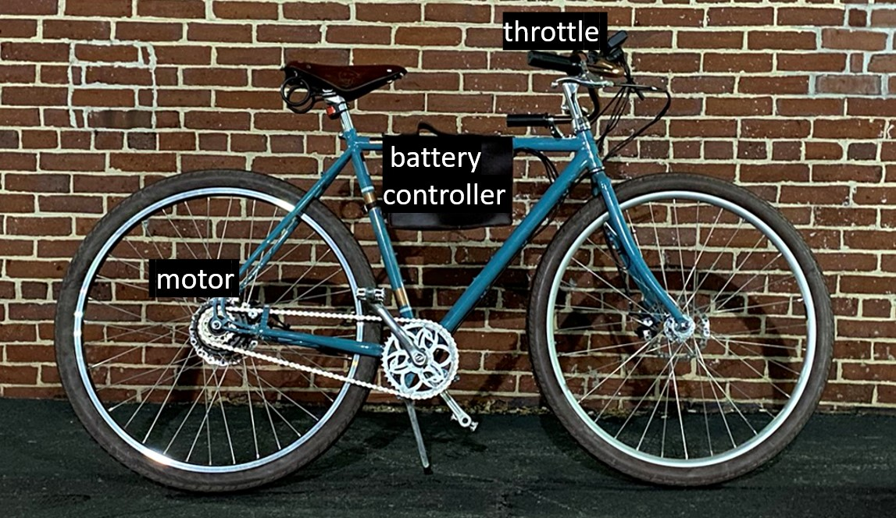
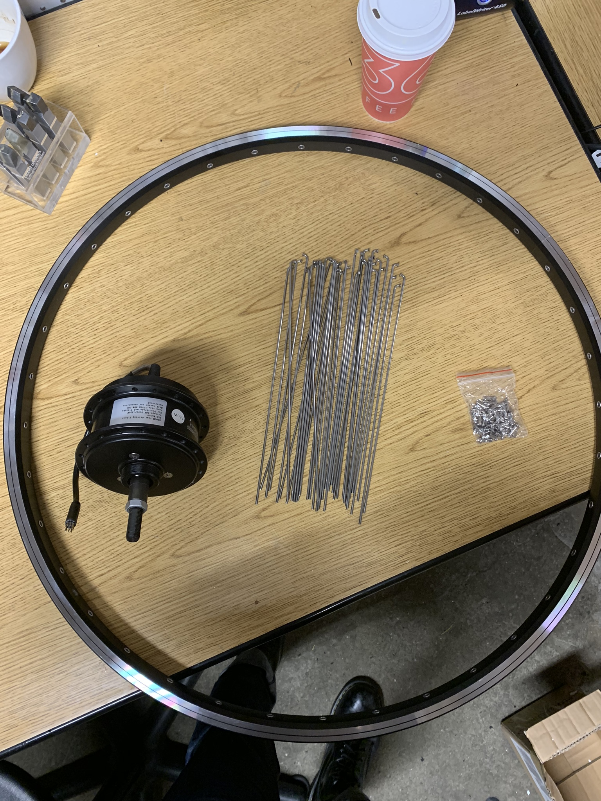
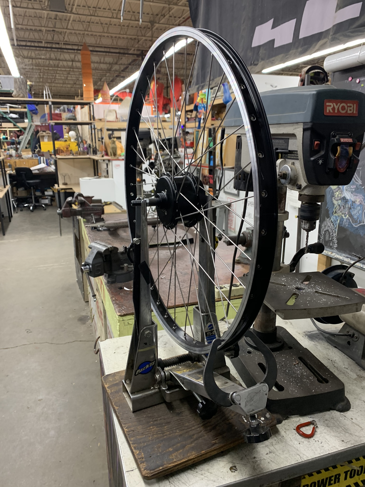
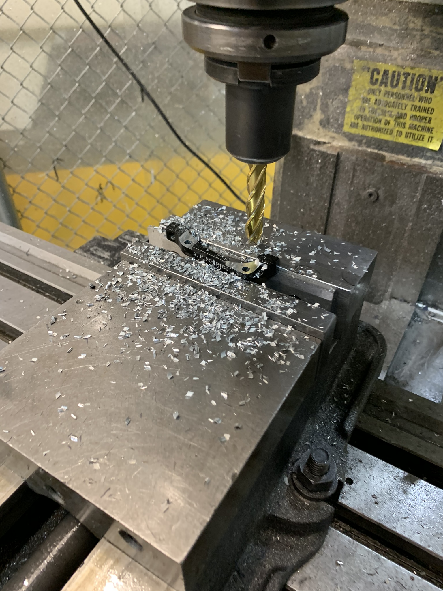
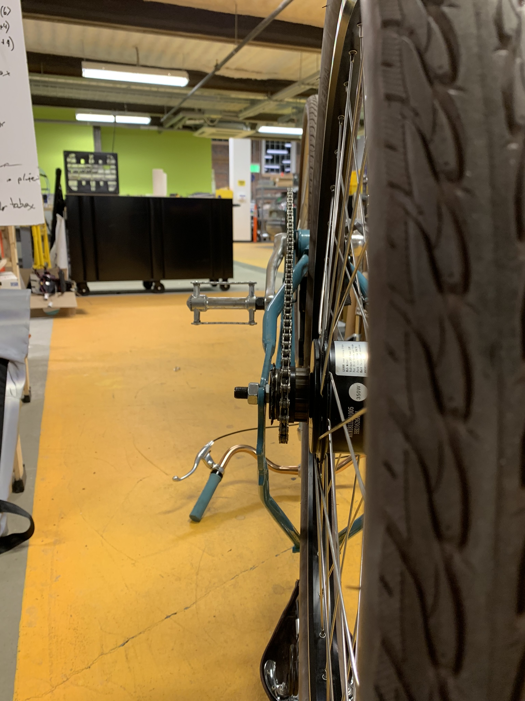
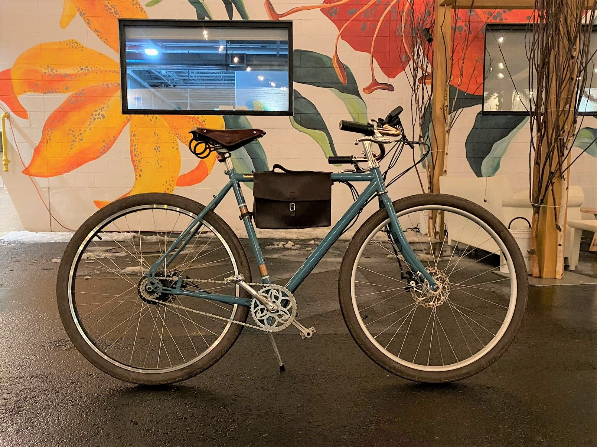

`youtube: fR6uySCIAOo`

*Demo of e-bike near Greentown Labs, super fun ride!*

## Summary

As any good MechE would do, I built myself an e-bike. But instead of sticking with the classic mainstays of cheap, unused bike with an assortment of electrical fixtures. I pursued a stealth build that required a bit of custom fabrication to get just right. The bike uses a small 16s1p, 60V nominal, 3Ah LiPo battery pack, an Infineon controller with the MOSFETs replaced with authentic [IRFB4110s](https://www.infineon.com/dgdl/irfb4110pbf.pdf?fileId=5546d462533600a401535615a9571e0b), and a Cycle Analyst V2 computer. Assuming a generous engineering safety factor, I limited peak power to 1500w (25A@60V) for initial tests, nothing has melted yet, but just to be safe I've dialed it down to 18A peak for daily use. The design was unconventionally optimized for high voltage but, relative to most high power Electrified bicycle designs, low current draw due to the limitation that the motor and motor wiring expect only 10A continuous.

Parameters | Value
------------ | ------------
Max Speed | 25MPH
Distance | 7mi
Acceleration | 0-25MPH, 10s with pedaling
Max Current | 18A
Max Voltage | 66V

## Photos

*Fig. 1: Custom wheel built to house the smallest hub motor available on the market, rated for 350w.*

*Fig. 2: Completed wheel on truing stand in the Skul space in Artisan's Asylum, double cross spoke pattern*

*Fig. 3: Machining disc brake caliper bracket as the hub was significantly wider than the original hub. Milling down bolt attach points enabled me to move the caliper 0.15" outwards from the center plane.*

*Fig. 4: Custom spacers were turned on the lathe to get proper chain alignment on a 7-speed freewheel hub that I converted to a single speed freewheel.*

*Fig. 5: Completed bicycle after test ride*
