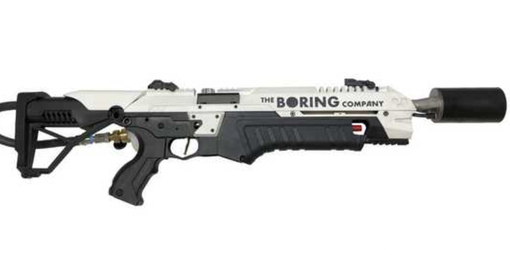
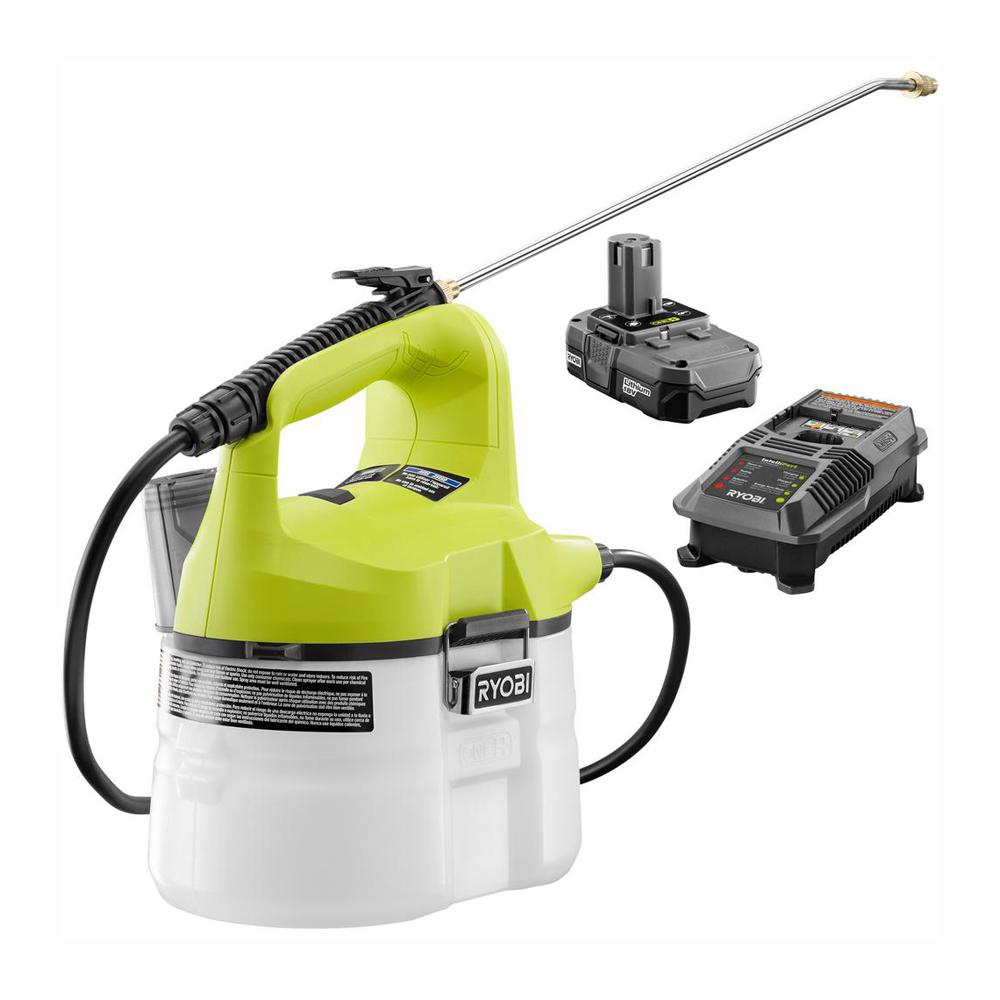
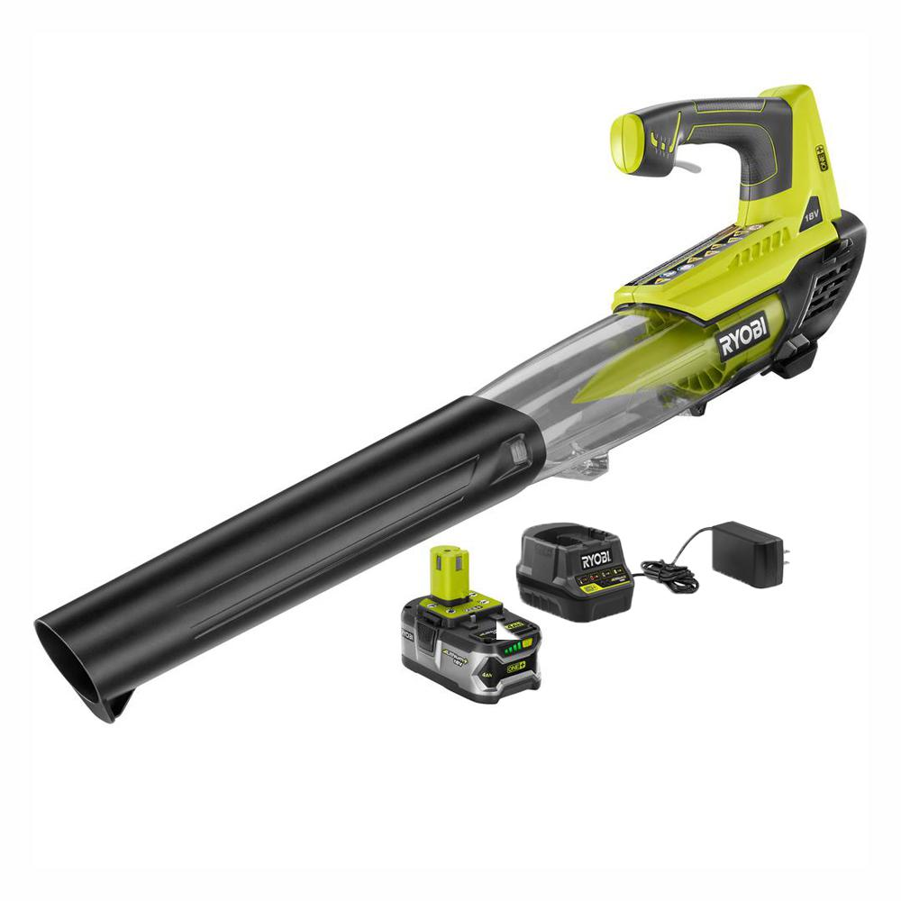

`youtube: D8L9ttLUJa8`

*Demonstration of Intumister, notice how Connor is both soaked and very cold!*

## Summary

A scorching hot day in Providence, RI, the Fox Point Booters had a game to play! Talking about it ahead of time with some of the other members, we discussed bringing water guns to the field to hose each other off. Instead I decided to make a misting cannon out of two off the shelf components, a leaf blower and a chemical sprayer, and then deploy it on 3rd base. The Intumister is a portmanteau of "Intumescent" + "Mister". Some might say it works as an evaporative cooler, but not in the traditional sense as the moisture does not fully vaporize at the outlet and instead is deposited as artificial sweat. The artificial sweat is then fully evaporated on your skin for conductive cooling, making it more effective then just blowing cool air, which would be purely forced convective cooling.

## Photos

*Fig. 1: The nemesis*

*Fig. 2: Ryobi Cordless Chemical Sprayer*

*Fig. 3: Ryobi Cordless Leaf Blower*
