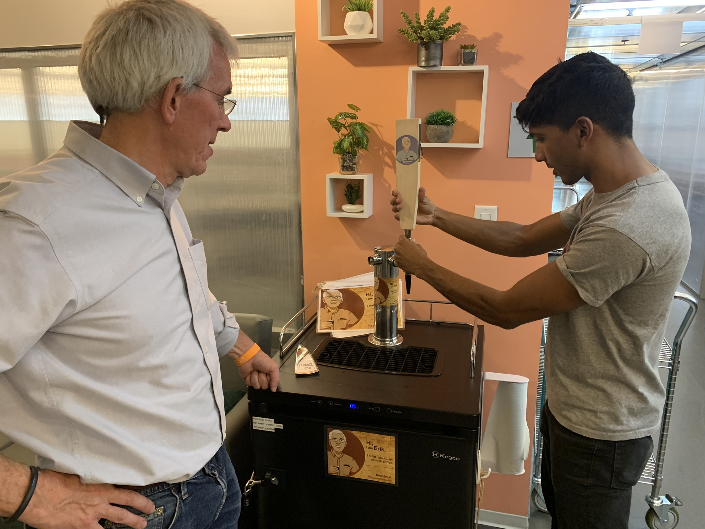
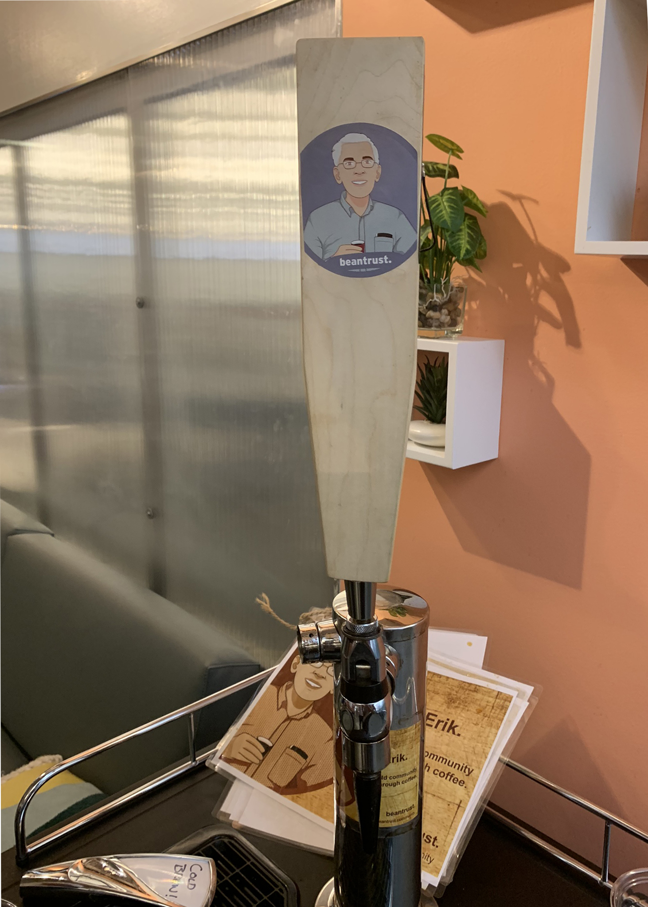

## Summary

TapWorks, as we called it, was a project conceived when my friend Erik Modahl of [beantrust.](https://beantrustcoffee.com/) approached me with a problem, "Nik, it would be great to know when my cold brew kegs are finished" After a quick market evaluation, I found a number of kludgy solutions to help with keg monitoring, but I came up with an idea that was even simpler. I designed a smart tap handle, and, with Rob KillKelley's help - built one. The technology is super simple, it consists of a cellular enabled micro controller, a battery, and a gyroscope - the tap handle measures the duration of pour. The data is then relayed to a server, and that server translates the data into an actionable data pipe stream.

Currently, there are tap handles in use to monitor the kegs at Mass CIC. Still in the data gathering phase, we have developed an auto-emailing system that notifies keg owners when to refill. The data and notifications generated enable low-volume Cold-brew and Kombucha brewers to operate in a lean, people and quality centric mode of operation.

## Photos

*Fig. 1: Initial prototype*

*Fig. 2: First deployment with Erik! Tap Handle and keg in question, pictured in background. Located on the 14th Floor, Mass CIC*

*Fig. 3: Close-up of first tap handle*
