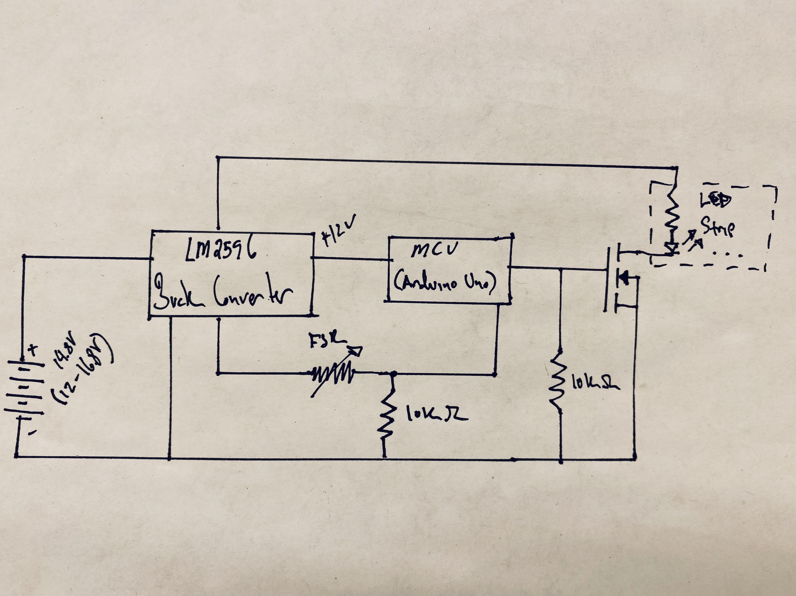
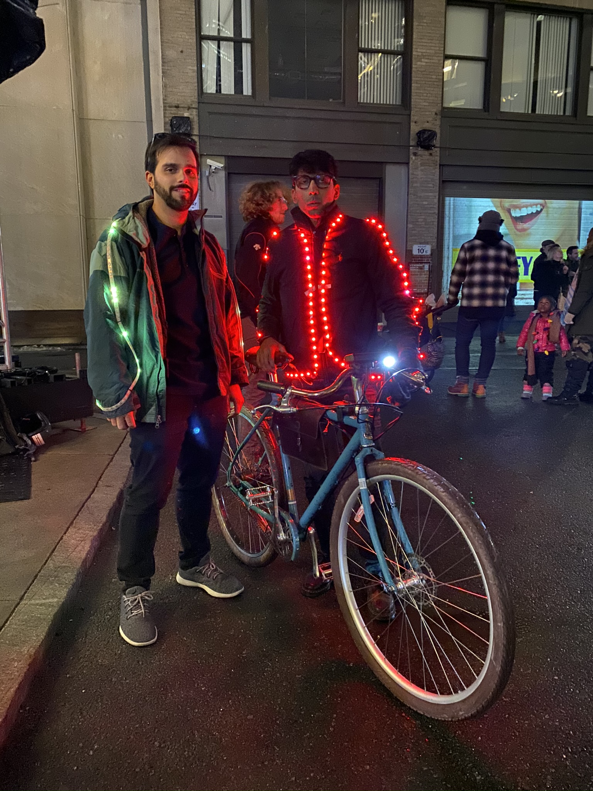

## Summary

My friend wanted to go to a light festival, and so we went illuminated. We chose projects the night before and hacked them together. The jacket reflects the breathing of the user; as the wearer's chest expands the lighting intensifies, and conversely, on contraction, the lighting dims. The expansion and contraction were measured by a Force Sensing Resistor (FSR) that I strapped to my chest with the mildly elastic belt I was wearing at the time. As a cyclist I want to remind people I am not just a binary dot hovering in the night: I am a living, breathing human - please do not run me over!

## Photos

*Fig. 1: Breathing in and out, early prototype using addressable LEDs and a Teensy 3.2 to control them*

*Fig. 2: Circuit design, did not include voltage cutoff for battery, really should have, BUT I used a 3Ah battery that had plenty of energy for the duration of the event.*

*Fig. 3: Completed circuit*

*Fig. 4: Jason Chrisos and I at the festival, pictured: [Electric Bike Project](https://niklal.me/ebike/)*
