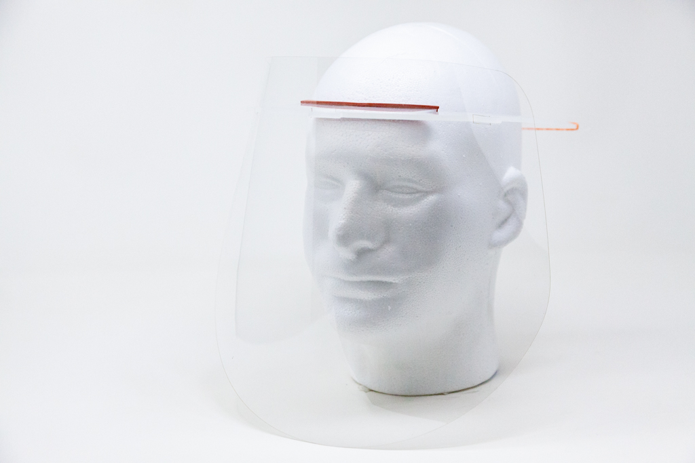
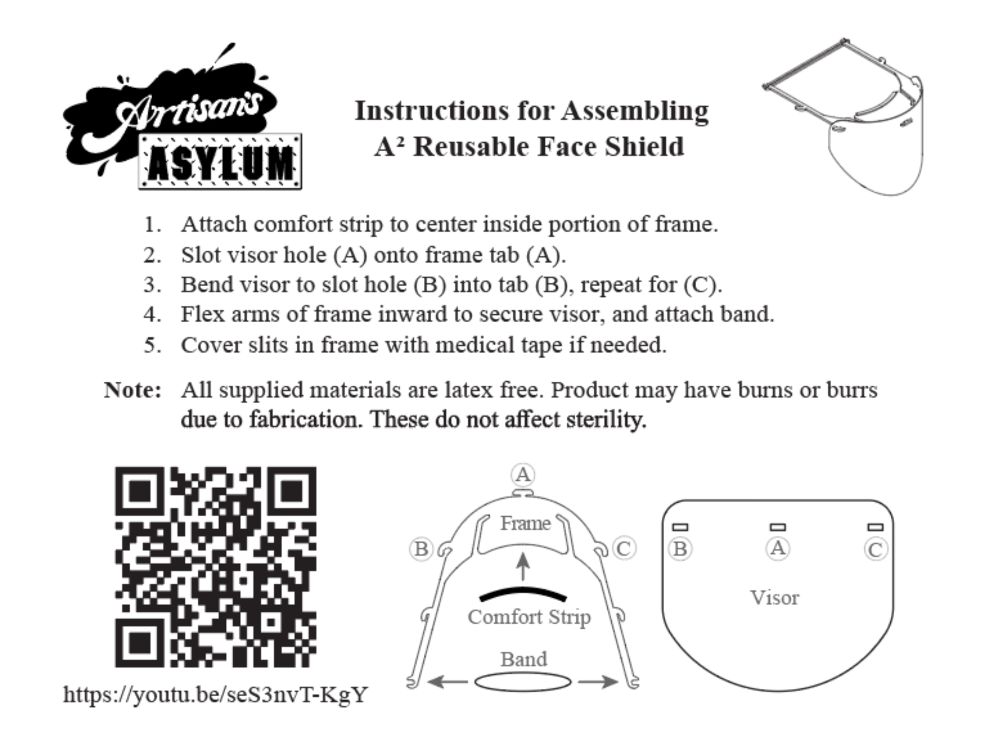

## Summary
In early March 2020, I elected to design a highly reusable yet easy to make frame based shield design for the SARS-CoV-2 pandemic. The constraints I set included no folds or creases in the plastic, and a design that could be autoclaved. The frame is made from polypropylene, the visor from polycarbonate, and both the comfort strip and elastic from silicone. Only the elastic is often made disposable to provide variable tension using either rubber bands or hair ties.

On April 30, 2020, the design received *NIH approval* for medical use during the pandemic under the FDA EUA guidelines for rapidly manufactured PPE.

During the months of April and May we built thousands of these shields.

[Link to GitHub Repo](https://github.com/nikaiser/SARS-CoV-2)

## Media
[Boston Herald](https://www.bostonherald.com/2020/03/31/coronavirus-crisis-prompts-somerville-artists-to-make-masks-hospital-gowns-for-health-care-workers/)
[WGBH](https://www.wgbh.org/news/local-news/2020/06/08/in-it-together-6-8-2020)

## Photos

*Fig. 1: Assembly instructions generated by Alex Crease.*

`youtube: seS3nvT-KgY`

*Fig.2: Assembly video*
