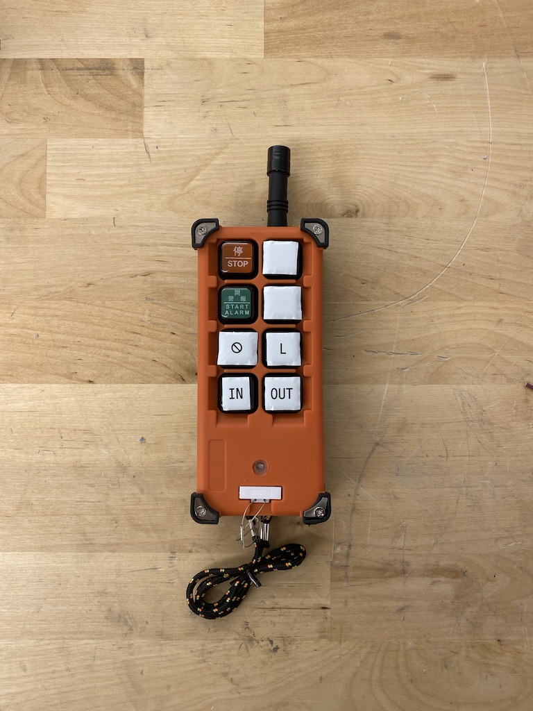
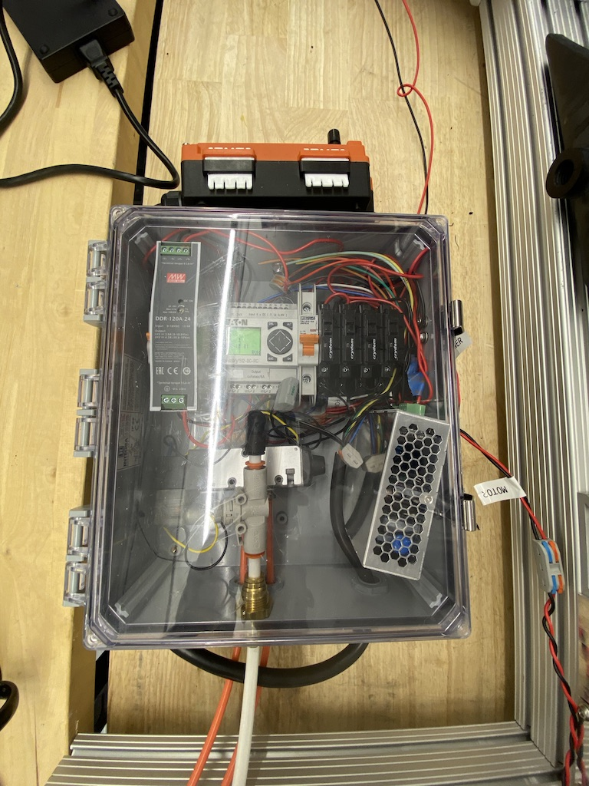

## Summary

For a first pass control system, I hacked together an off the shelf PLC, a handful of SSRs to make an H Bridge, a 4/2 pneumatic air valve, and a knock-off crane controller from China. The end result is a wirelessly controllable robot with a pneumatically actuated piston.

## Photos

*Fig. 1: After a few different changes, things got pretty crowded in this assembly. Fred's next revision looked much nicer.*
