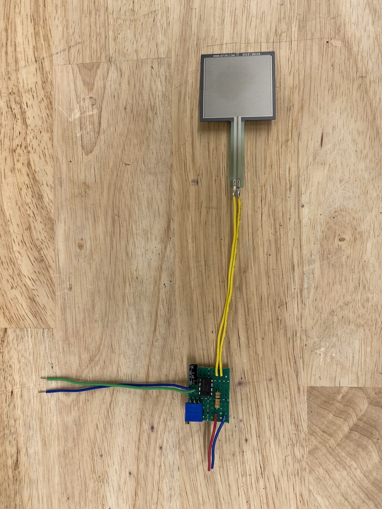
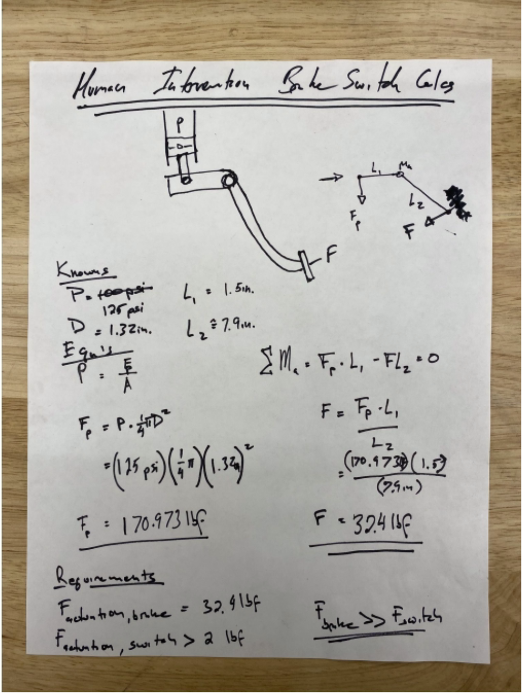
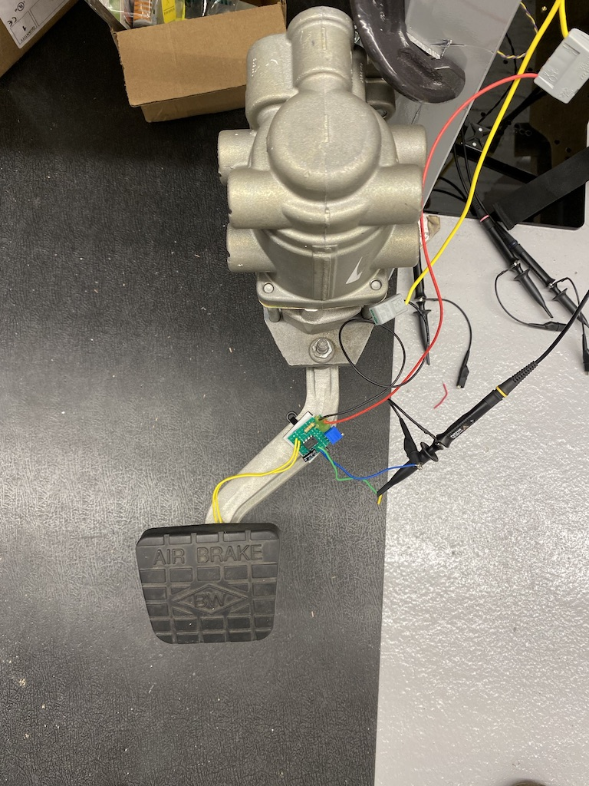

## Summary
To address driver safety needs, a pressure sensitive pedal was added to the truck. To model driver foot force, a Force Sensitive Resistor (FSR) was added beneath the pedal cover. To make the analog output digital, a Schmitt Trigger designed around an LM741 Op-Amp was used.

## Photos

*Fig. 1: FSR needed to detect a force of up to 32lbs and the Schmitt Trigger was set to an equivalent resistance of 2lbs.*

*Fig. 2: Circuit layout with adjustable trigger point.*

*Fig. 3: Pedal test set-up.*
