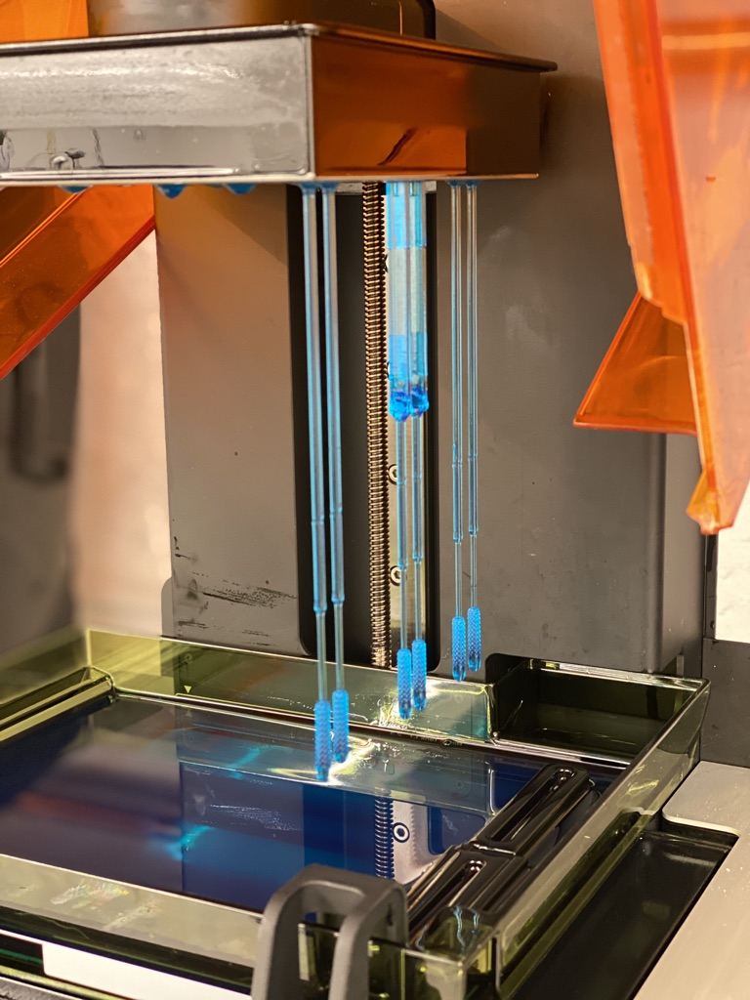

## Summary
During the SARS-COV2 pandemic I designed a swab for e25bio that integrated their lateral flow assay into the nasopharyngeal swab. I based the honeycomb design on the [Northwell approved tip](https://spectrum.ieee.org/the-human-os/biomedical/devices/healthcare-team-designed-3dprinted-tested-covid19-swabs-one-week), and I designed the assay section around the test strips used. Initially printed using the Tough resin while waiting for the Surgical Guide Resin to arrive, I switched for final prototypes to ensure biocompatibility.
