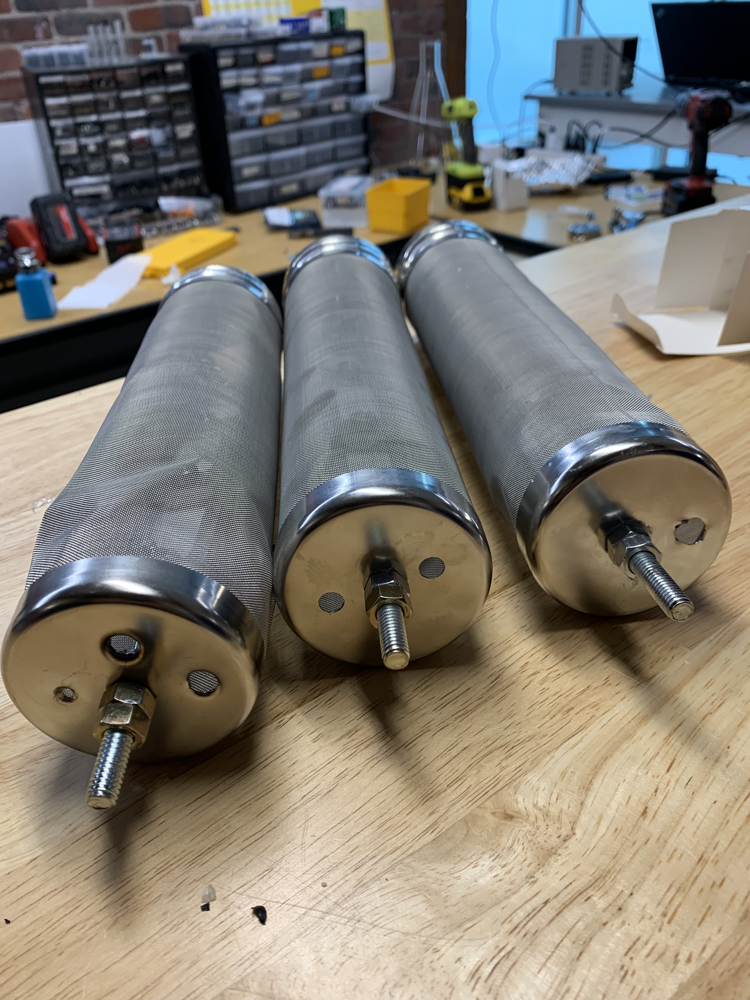
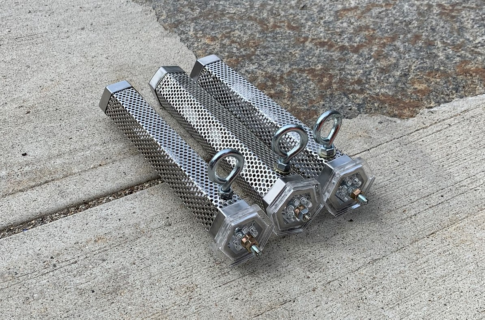

`youtube: oLlYg-b9A_Q`

*Install of sampler in Cambridge manhole*

#### Role
Designer

## Summary

As an alternative to the costly hardware sampler, Dr. Endo developed a passive sampler concept based on a similar chemical sampling premise. To execute on this vision, I designed and built the device. To simplify the design, and enable cheap and easy construction - I sourced off-the-shelf, stainless steel housings from other industries and applied them in a creative and mildly custom design.

## Photos

*Fig. 1: Rev 1 passive sampler, very difficult to manufacture as drilling into the soft but case hardened stainless steel was problematic due to the weak structure. Case was designated as a "beer hopper" for homebrew use.*

*Fig. 2: Rev 2 passive sampler, much easier to manufacture with custom laser cut end caps on one side and added eyelets to the sidewall. Case was designated as "wood chip smoker" for barbeque use.*
