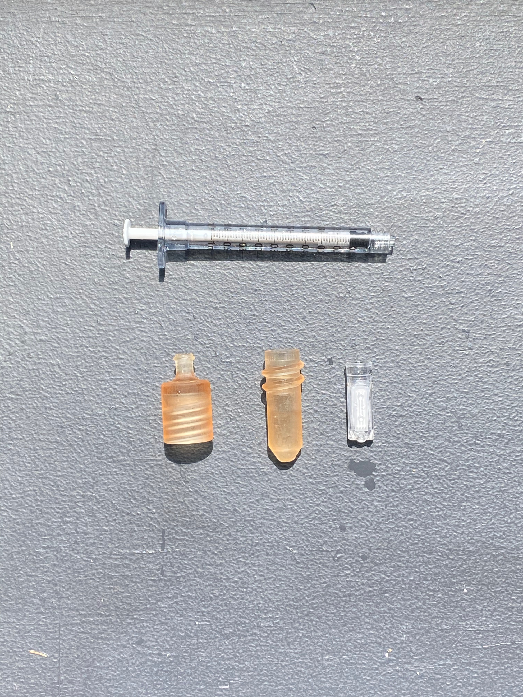
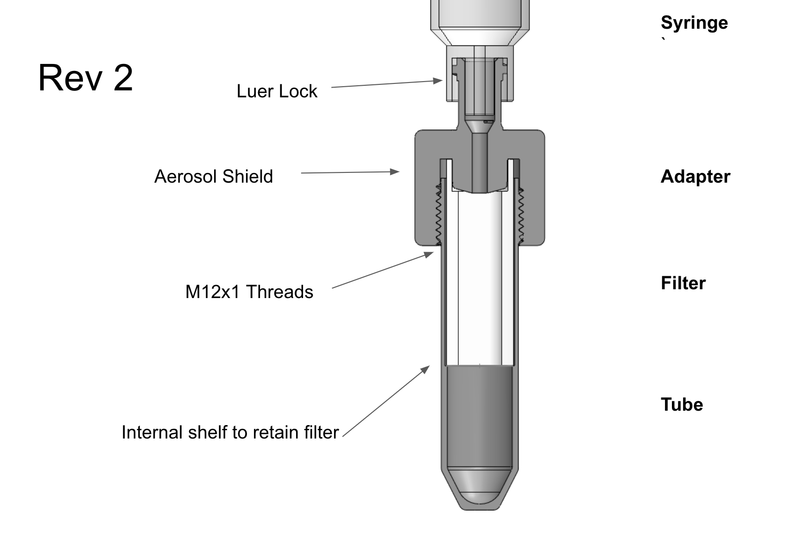
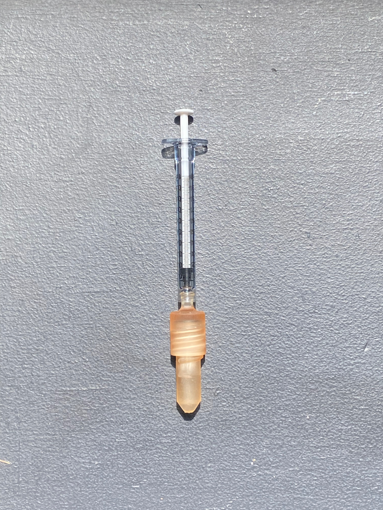

## Summary
E25bio asked me to design a field use pressure concentrator for protein concentration. During this process I modeled and 3D printed iterations on a Formlabs Form 2 using their Surgical Guide resin to create working proof of concept. The syringe pressurizes the test fluid through an Amicon Ultra centrifuge filter, the lysate is then extracted from the filter. The benefit is that you can concentrate the proteins as you would in the lab, but without the need for a centrifuge. Device should only be used by trained professionals, for at home use we pursued a much safer method, as positive pressure with infectious material should be confined to subject matter experts.

## Photos

*Fig. 1: Revision2 in development.*

*Fig. 2: Fully assembled with 1ml syringe and 30kDa Ultrafilter.*
