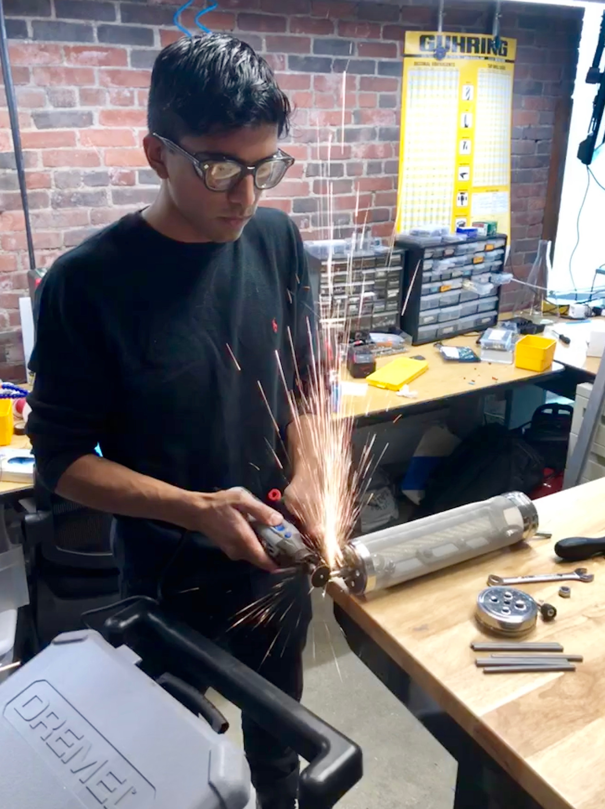

*Pictured, me, with Dremel.*

### General

A consummate engineer, I have always enthusiastically pursued science and research from a young age. I am passionate about mechanical design and continuously look for innovative solutions to modern problems. Never one to stop learning, when I’m not working, I study industry-level research on macro trends but leave time to hang out with friends, and spend as much time as I can outdoors. Experienced, mechanical-focused hardware engineer, with an emphasis on prototyping hardware and motivating and leading small teams to develop significant projects. Substantial experience in overseas customer and supplier management, and conversant in French. Awarded 1 patent, and have filed for 4 additional patents since in 4 different fields.

### [Curriculum Vitae](cv.pdf)

### Background

Born in Maryland, I followed my parents around the world as my mother served the US Department of State as a diplomat and my father an entrepreneur. Spending time in Africa, Asia, and Europe - I've never truly known where to call home, but I do have a strong appreciation for other people and their cultures. Having visited 60 countries, I feel enormously grateful to have had such a holistic upbringing. Earliest achievements I am the most proud of: making the rank of Eagle Scout despite scouting in 4 different countries, International Award Bronze and Silver level, and participating in THIMUN 3 times.

*Eagle Scout Court of Honor (Troop 236, US Embassy, Rome, Italy)*

*Countries visited*

## Education

I received a Bachelor's degree in Mechanical Engineering and a Master's degree in Systems Engineering with a focus in entrepreneurship from Cornell University (Ithaca, NY).

### Sports

I spend as much time as I can outside. Hiking, climbing, mountain biking, and snowboarding are my seasonally dependent go-to's. I've participated in a variety of club sports over the years, including soccer, tennis, dodgeball, and as the founder of the Fox Point Booters, a competitive league team in Providence, RI.

*
[Fox Point Booters](https://www.instagram.com/foxpointbooters/), on a dusty field in Providence RI*

*
Somewhere on Cannon Mountain, NH.*

*
Near the summit of the Schwarzhorn (Bernese Oberland, Swiss Alps)*

### Hobbies

When I'm not outside I spend a lot of my time buried in papers, videos, and instructional documentation in engineering and determining engineering solutions to major world problems. I have also played competitive darts, foosball, and a bit of axe throwing.

*Axe Gang by Cold Steel, the axe I threw with to reach 2nd place at the local league, handle cut to 13.75in*
